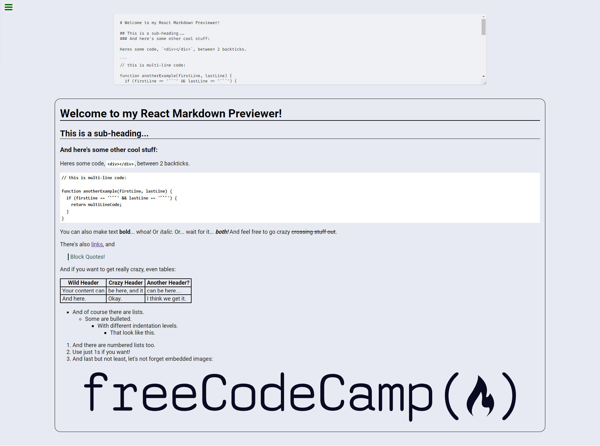

# React Markdown Previewer

React project built for
[FreeCodeCamp's front-end development libraries certification](https://www.freecodecamp.org/learn/front-end-development-libraries/front-end-development-libraries-projects/build-a-markdown-previewer)

## Usage

The purpose of this project was to build markdown previewer in React using
[Marked.js library](https://marked.js.org/)

## Tech Stack

**Client:** HTML5, CSS3, JavaScript, React, [Marked.js](https://marked.js.org/)

## Authors

- [@haylzrandom - Github](https://www.github.com/haylzrandom)
- [@haylzrandom - FreeCodeCamp](https://www.freecodecamp.org/haylzrandom)

## Screenshots

## License

[MIT](https://choosealicense.com/licenses/mit/)
